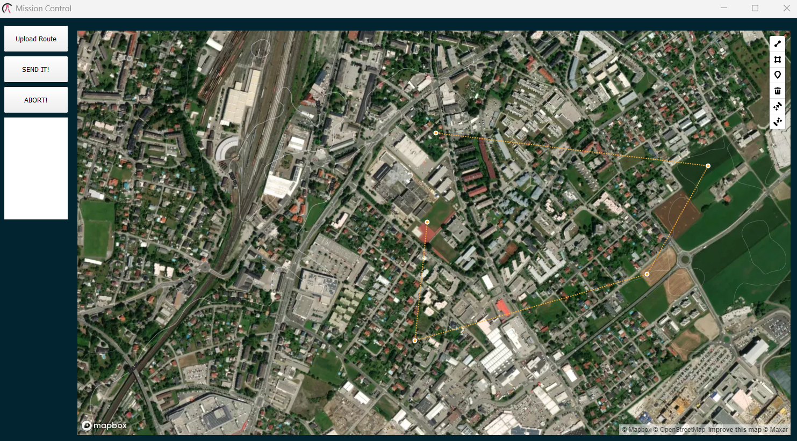
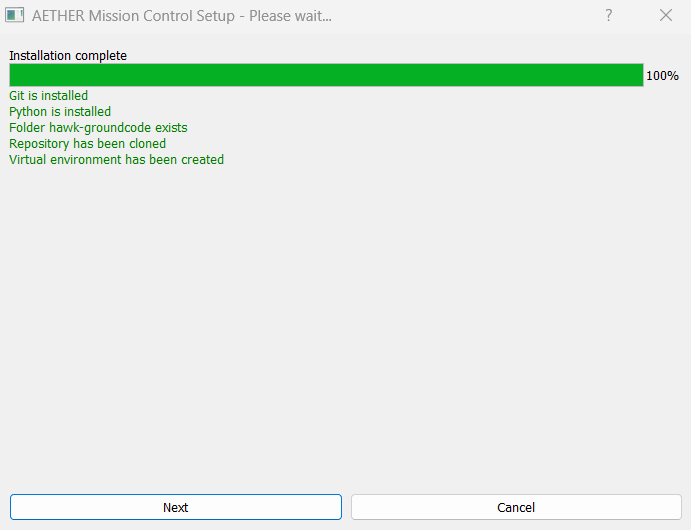
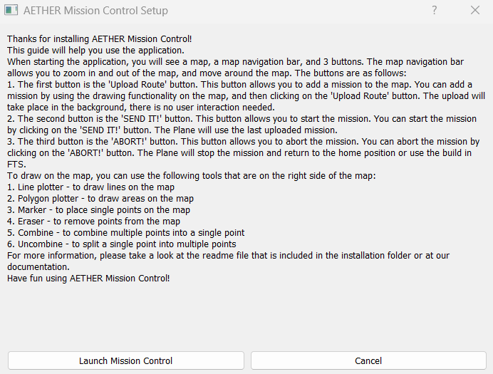

# AETHER Groundcode - Groundstation #
## General Structure ##

The groundcode is structured in the following way (links to files/folders):
- env - contains the virtual environment
- [missioncontrol](https://github.com/AetherAerospace/hawk-groundcode/tree/main/missioncontrol) - contains the source code for the application
  * [map.py](https://github.com/AetherAerospace/hawk-groundcode/blob/main/missioncontrol/map.py) - contains the main code of the application
  * token.py - contains the mapbox token for the map
  * [toserial.py](https://github.com/AetherAerospace/hawk-groundcode/blob/main/missioncontrol/toserial.py) - this module reads and writes to the serial port with multithreading
- [lora-esp32](https://github.com/AetherAerospace/hawk-groundcode/tree/main/lora-esp32) - contains the code for the ground station ESP32 board with LoRa
  * [platformio.ini](https://github.com/AetherAerospace/hawk-groundcode/blob/main/lora-esp32/platformio.ini) - PlatformIO configuration file
  * [src](https://github.com/AetherAerospace/hawk-groundcode/tree/main/lora-esp32/src) - contains the source code for the ESP32 board
    * [pins](https://github.com/AetherAerospace/hawk-groundcode/tree/main/lora-esp32/src/pins) - contains header files with pin definitions
    * [proc](https://github.com/AetherAerospace/hawk-groundcode/tree/main/lora-esp32/src/proc) - contains the more code heavy processing stuff and modules
    * [settings](https://github.com/AetherAerospace/hawk-groundcode/tree/main/lora-esp32/src/settings) - header files with settings for other code modules
    * [utils](https://github.com/AetherAerospace/hawk-groundcode/tree/main/lora-esp32/src/util) - general use modules and code
    * [main.cpp](https://github.com/AetherAerospace/hawk-groundcode/blob/main/lora-esp32/src/main.cpp) - contains the main code for the ESP32 board
- [setup-win.py](https://github.com/AetherAerospace/hawk-groundcode/blob/main/setup-win.py) - setup file for Windows
- [requirements.txt](https://github.com/AetherAerospace/hawk-groundcode/blob/main/requirements.txt) - contains the requirements for the application
- [mission-control.py](https://github.com/AetherAerospace/hawk-groundcode/blob/main/mission-control.py) - main file for the application

## Ground Station ##

*Will be added by @0xk1f0*

## Mission Control ##



AETHER Mission Control is a desktop application that allows you to control the AETHER drone. It is written in Python and uses the [PyQt5](https://pypi.org/project/PyQt5/) library for the GUI.

It is split into 3 main parts:
- The [mission control module](#mission-control-module)
- The [main application](#main-application-file) file
- The [setup](#setup) file

Follow [this guide](#guide) on how to use the application.

### Main Application ###
The main application file is [mission-control.py](https://github.com/AetherAerospace/hawk-groundcode/blob/main/mission-control.py). It contains the following code and is self explanatory:
```Python
#import main function from main.py in the folder mission-control
from missioncontrol.map import main

#call the main function
if __name__ == "__main__":
    main()
```

### Mission Control Module ###
The mission control module is the main part of the application. It contains the following files:
- [map.py](#mappy) - contains the main code of the application
- [token.py](#tokenpy) - contains the mapbox token for the map
- [toserial.py](#toserialpy) - this module reads and writes to the serial port with multithreading

#### Map.py ####
map.py contains the main gui code for the application. It contains a main function `main()` that creates the gui and the main window class `MainWindow`. The main window class contains the following functions:
- `__init__()` - initializes the main window and creates the gui. As part of the initialization, it also creates the map and three buttons to control the drone.
```Python
def __init__(self):
    #Window (...)
    #Map (...)
    #Buttons (...)
    #see map.py for full code
```

- `def on_button1_clicked` - this function is called when the first button is clicked. It sends the waypoint data to the ground station via the toserial module. The ground station will then read the data and upload it to the drone.
```Python
def on_button1_clicked(self):
        self.map_view.page().runJavaScript("getLine()", self.on_markers_retrieved)
```

- `on_markers_retrieved` - this function scrapes the data from a predefined JavaScript function in the mapbox map. It is called inside the `on_button1_clicked` function and returns the waypoint json data.

```Python
#generate a json object with the points of the drawn line and send it to the drone
def on_markers_retrieved(self, markers_data):
    markers = markers_data
    #extract the points from the returned data
    markersExtracted = markers['features'][0]['geometry']['coordinates']
    #print the returned points in the text output
    self.text.setText(str(markersExtracted))
    #save the points in a json file
    with open("markers.json", "w") as f:
        json.dump(markers, f)
    
    #upload the points to the drone
    self.upload_to_drone(markersExtracted)
```

- `upload_to_drone` - this function uploads the waypoint data to the drone. It is called inside the `on_markers_retrieved` function. It uses the toserial module to write the data to the serial port. <br>
To circumvent errors, it uses a try catch block to catch errors and close the serial port in case of an error. It also uses multithreading to read and write to the serial port at the same time.
```Python
#upload the json to the drone via serial communication
def upload_to_drone(self, markers):
    print("\033[92m" + "UPLOAD TO DRONE" + "\033[0m")
    print(markers)
    #surround the communication with a try catch block to catch errors
    try:
        #send the points to the drone via serial communication
        #listen to the serial port
        read_thread = threading.Thread(target=read_from_serial)
        #send the points to the serial port
        write_thread = threading.Thread(target=write_to_serial, args=(markers,))
        #start the threads
        read_thread.start()
        write_thread.start()
        #wait for the threads to finish
        read_thread.join()
        write_thread.join()
        #close the serial port
        close_serial()
    except Exception as e:
        print("\033[91m" + "ERROR: " + str(e) + "\033[0m")
        #close the serial port
        close_serial()
```

- `def on_button2_clicked` - this function is called when the second button is clicked. It sends the start command to the ground station via the toserial module. The ground station will then read the data and upload it to the drone.
```Python
#send a command to the drone to start the mission
def on_button2_clicked(self):
    print("\033[92m" + "SEND IT!" + "\033[0m")
    #surrond the communication with a try catch block to catch errors
    try:
        #send the command to the drone to start the mission
        #listen to the serial port
        read_thread = threading.Thread(target=read_from_serial)
        #send the command "SEND_IT" to the serial port
        write_thread = threading.Thread(target=write_to_serial, args=("SEND_IT",))
        #start the threads
        read_thread.start()
        write_thread.start()
        #wait for the threads to finish
        read_thread.join()
        write_thread.join()
        #close the serial port
        close_serial() 
    
    except Exception as e:
        print("\033[91m" + "ERROR: " + str(e) + "\033[0m")
        #close the serial port
        close_serial()
```

- `def on_button3_clicked` - this function is called when the third button is clicked. It sends the stop command to the ground station via the toserial module. The ground station will then read the data and upload it to the drone.
```Python
#send a command to the drone to abort the mission
def on_button3_clicked(self):
    print("\033[91m" + "ABORT!" + "\033[0m")
    #surrond the communication with a try catch block to catch errors
    try:
        #send the command to the drone to abort the mission
        #listen to the serial port
        read_thread = threading.Thread(target=read_from_serial)
        #send the command "ABORT" to the serial port
        write_thread = threading.Thread(target=write_to_serial, args=("ABORT",))
        #start the threads
        read_thread.start()
        write_thread.start()
        #wait for the threads to finish
        read_thread.join()
        write_thread.join()
        #close the serial port
        close_serial() 
    except Exception as e:
        print("\033[91m" + "ERROR: " + str(e) + "\033[0m")
        #close the serial port
        close_serial()
```

#### token.py ####
`token.py` contains the mapbox token for the map. It is used in the map.py file to create the map.
<br>
When you create your own mapbox account, you will get your own token. You can then add your token via the setup script or manually in the token.py file. <br>
Note that the token is not included in the repository for security reasons. <br>
Also note that the file has a specific structure:
```Python	
MAP_TOKEN = 'YOUR-TOKEN-HERE'
```
USE SINGLE QUOTES!

#### toserial.py ####
`toserial.py` contains the functions to write and listen to the serial port. It is used in the main.py file to send the waypoint data to the drone. <br>
Write and read functions are implemented to run multithreaded. <br>
- `choose_serial`<br>
At first, the os is checked to determine the serial port. This check is necessary because the serial port is different on Windows and Linux. It is checked every time the functions are called to make sure the correct port is used. <br>
```Python	
#choose the serial connection based on the OS
def choose_serial():
    #if the running OS is windows use the windows serial connection
    if os.name == 'nt':
        #find the COM port of the serial connection and return it
        for i in range(256):
            try:
                #try to open the COM port as string
                s = serial.Serial("COM" + str(i), 115200)
                s.close()
                #output the COM port number and make the background of the print green
                print("\033[92m" + "COM port found! COM port: " + str(i) + "\033[0m")
                return serial.Serial("COM" + str(i), 115200)
            except serial.SerialException:
                pass
        #if no COM port is found, return an error and make the background of the print red
        print("\033[91m" + "ERROR: No COM port found!" + "\033[0m")

    #if the running OS is linux use the linux serial connection
    elif os.name == 'posix':
        #find the ttyUSB port of the serial connection and return it
        for i in range(256):
            try:
                #try to open the ttyUSB port as string
                s = serial.Serial("/dev/ttyUSB" + str(i), 115200)
                s.close()
                #output the ttyUSB port number and make the background of the print green
                print("\033[92m" + "ttyUSB port found! ttyUSB port: " + str(i) + "\033[0m")
                return serial.Serial("/dev/ttyUSB" + str(i), 115200)
            except serial.SerialException:
                pass
```
- `read_from_serial`<br>
This function reads the data from the serial port. It is used to check if the command has been received by the ground station. <br>
```Python
# Define a function for reading from the serial connection
def read_from_serial():
    #set the serial connection type based on the OS
    ser = choose_serial()

    global stop
    while not stop:
        # Read data from the serial connection
        data = ser.readline()

        # Print the data to the terminal
        print(data)

        # Check if the command "success" has been received
        if data == b'success\n':
            # Signal to the threads to stop
            stop = True
```

- `write_to_serial`<br>
This function writes the data to the serial port. It is used to send commands to the ground station. <br>
```Python
# Define a function for writing to the serial connection
def write_to_serial(send_data):
    #set the serial connection type based on the OS
    ser = choose_serial()

    global stop
    while not stop:
        #send the send_data to the drone
        ser.write(send_data.encode())
        #after sending the data, send the string "complete" to the drone
        ser.write("complete".encode())
```	

- `close_serial`<br>
This function closes the serial port. It is used to close the serial port after the threads have finished. <br>
```Python
# Define a function for closing the serial connection
def close_serial():
    #set the serial connection type based on the OS
    ser = choose_serial()

    # Close the serial connection
    ser.close()
```

- `multithreading`<br>
Multithreading is used to send the waypoint data to the drone and to listen to the serial port at the same time. <br>
Threads are started and joined outside of `toserial.py` in the `main.py` file. <br>
```Python
# Create a thread for reading from the serial connection
read_thread = threading.Thread(target=read_from_serial)
# Create a thread for writing to the serial connection
write_thread = threading.Thread(target=write_to_serial)
```

### Setup ###
#### Windows ####
The setup script is used to install the required packages and to add the mapbox token to the token.py file. <br>
The script is called with the following command:
```bash
python3 setup-win.py
```


The installer is based on PyQt5. 
To run the installer, you need to install PyQt5. <br>
You can install PyQt5 with the following command:
```bash
pip install PyQt5
```

1. The installer checks for basic requirements and installs the required packages. <br>
Checks:
- Python version
- pip version
- Git version

2. After the checks, it checks if Mission Control is already installed: <br>
If Mission Control is already installed, the installer moves to the folder and pulls the latest version from the repository. <br>
If Mission Control is not installed, the installer clones the repository.
If Mission Control is installed, the clone command is skipped. <br>


3. Next the installer creates a virtual environment and activates it. After that, the required packages are installed. <br>
```Python
...
#get the current user
user = getpass.getuser()
#change the directory to the folder hawk-groundcode
os.chdir("C:\\Users\\" + user + "\\hawk-groundcode")
#create the virtual environment
os.system("python -m venv env")
#activate the virtual environment with the command env\Scripts\activate
os.system("env\Scripts\activate")
#install the requirements
os.system("pip install -r requirements.txt")
...
```

<br>
<br>
4. After the checks and the clone/pull, the installer asks for the mapbox token. <br>
The token is then added to the token.py file following the [defined structure](#tokenpy) <br>

```Python
...
# Execute the dialog event loop
if dialog.exec_():
    # Create an instance of your application's dialog
    dialog = InputDialog()
    # Show the dialog
    dialog.show()
    # Execute the dialog event loop
    if dialog.exec_():
        #get the current user
        user = getpass.getuser()
        #get the text from the line edit
        text = dialog.text
        #append the text with a prefix and a suffix
        text = "MAP_TOKEN = '" + text + "'"
        filePath = "C:\\Users\\" + user + "\\hawk-groundcode\\missioncontrol\\token.py"
        #create a file and write the text into hawk-groundcode\missioncontrol and name it token.py
        f = open(filePath, "w")
        f.write(text)
        f.close()
        
        #execute the dialog event loop
        dialog = FinishDialog()
        dialog.show()
        if dialog.exec_():
            #start the mission-control.py file
            os.system("python C:\\Users\\" + user + "\\hawk-groundcode\\mission-control.py")
            #close the application
            sys.exit()
    else:
        #close the application
        sys.exit()
else:
    #close the application
    sys.exit()
...
```


<br>
<br>
5. After the token is added to the token.py file, the installer shows a short introduction on how to use Mission Control. <br>
The installer then starts the `mission-control.py` file. <br>



#### Linux/MacOS ####
*Not yet implemented*

## Guide ##
### Mission Control ###
This guide will help you use the application.
When starting the application, you will see a map, a map navigation bar, and 3 buttons. The map navigation bar allows you to zoom in and out of the map, and move around the map. The buttons are as follows:
1. The first button is the 'Upload Route' button. This button allows you to add a mission to the map. You can add a mission by using the drawing functionality on the map, and then clicking on the 'Upload Route' button. The upload will take place in the background, there is no user interaction needed.
2. The second button is the 'SEND IT!' button. This button allows you to start the mission. You can start the mission by clicking on the 'SEND IT!'button. The Plane will use the last uploaded mission.
3. The third button is the 'ABORT!' button. This button allows you to abort the mission. You can abort the mission by clicking on the 'ABORT!' button.The Plane will stop the mission and return to the home position or use the build in FTS
To draw on the map, you can use the following tools that are on the right side of the map:
1. Line plotter - to draw lines on the map
2. Polygon plotter - to draw areas on the map
3. Marker - to place single points on the map
4. Eraser - to remove points from the map
5. Combine - to combine multiple points into a single point
6. Uncombine - to split a single point into multiple points
For more information, please take a look at the readme file tha tis included in the installation folder or at our documentation.
Have fun using AETHER Mission Control!